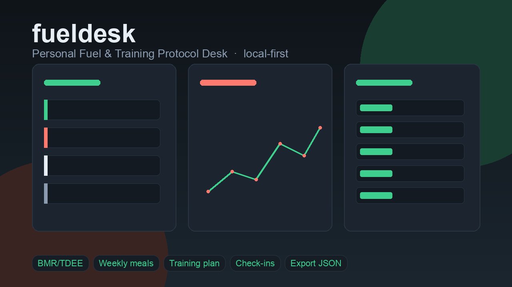

# fueldesk

**Local-first Personal Fuel & Training Protocol Desk.**

Enter your body stats and constraints once. fueldesk builds **transparent calorie/macro targets**, a **weekly meal plan**, and a **weekly training protocol** — then helps you adjust from check-ins. No SaaS, no social feed, no barcode paywall.



> **Disclaimer:** Educational fitness planning only — **not medical advice**. Consult a qualified professional before changing diet or exercise.

## Why fueldesk?

Most tools are **loggers** (food diaries, set trackers) or heavy gym CMS suites. fueldesk is **plan-first**:

1. Profile → who you are + constraints  
2. Targets → Mifflin-St Jeor BMR/TDEE/macros with visible math  
3. Protocol → week of meals + training matched to equipment & diet flags  
4. Check-ins → gentle next-week suggestions when progress stalls  

## Use cases

1. **Recomp beginner** — 28F, home dumbbells, 4 days/week. Fill the profile, generate protocol, leave with daily targets plus a full week of meals and sessions in under 10 minutes.  
2. **Cut with constraints** — vegetarian, no dairy, office job. Macro targets respect diet flags; meal slots pull only from allowed seed foods.  
3. **Stall adjust** — weight flat ~14 days with solid adherence. Check-in history surfaces a small deficit or volume tweak instead of starting from zero.

4. **AI onboarding** — paste "28F, 165cm, 62kg, vegetarian, lose fat, 4 days/week dumbbells" under **AI Assist → Describe yourself**, preview fields, apply & regenerate protocol offline.
5. **Meal photo estimate** — upload a plate (or caption keywords) for rough macros; edit and save to check-in notes. Estimates only.
6. **Equipment from photo/caption** — "rack, bench, dumbbells" → chips → apply to profile equipment.

## Quick start

```bash
# Python 3.11+
cd fueldesk
python -m venv .venv
source .venv/bin/activate  # Windows: .venv\Scripts\activate
pip install -e ".[dev]"

# Run tests
pytest

# Serve local UI (default 127.0.0.1:8792)
fueldesk serve
# or: python -m fueldesk serve --host 127.0.0.1 --port 8792
```

Open [http://127.0.0.1:8792](http://127.0.0.1:8792) → **Profile** → save → explore Dashboard, Targets, Meals, Training, Check-ins.

Optional: `FUELDESK_DB=/path/to/custom.db fueldesk serve`

## Features (MVP)

| Area | What you get |
|------|----------------|
| Profile | Sex, age, height, weight, activity, goal, diet flags, equipment, days/week, experience |
| Targets | BMR / TDEE / calories / P-C-F with formula breakdown |
| Meals | 7-day plan from local food DB; swap items; diet filters |
| Training | 7-day plan; rest days; equipment-aware exercise pool |
| Check-ins | Weight, meal/training adherence, energy + suggestions |
| Export | `GET /export.json` full dump |
| AI Assist | Profile text parse, meal photo estimate, equipment from image/caption |
| AI providers | Offline heuristics (default), Gemini via Google ADK, Ollama HTTP, OpenAI-compatible API |
| ADK Coach | Multi-turn chat with tools (profile/targets/meal/equipment/regen) — confirm before apply |
| Settings | Provider / base URL / model / API key (masked; env overrides) |
| CLI | `fueldesk serve`, `fueldesk version` |

## Why not X?

| Alternative | Why not (for this job) |
|-------------|-------------------------|
| **MyFitnessPal / Cronometer** | Diary-first SaaS; plan quality weak; freemium/privacy friction |
| **wger** | Full FLOSS gym suite — heavier CMS feel, not a lightweight protocol desk |
| **workout.cool** | Excellent coaching/workouts — not equal-weight diet protocol from biometrics |
| **Mealie** | Recipe CMS, not body-stat macros + training |
| **Strong / Hevy** | Best-in-class lifting logs — little diet protocol |
| **Generic AI chatbots** | Opaque plans, no local ownership, weak weekly structure |

fueldesk does **not** clone those UIs or codebases. It owns the **plan-from-profile** job locally.

## Stack

- Python 3.11+, FastAPI, Jinja2, SQLAlchemy 2.x, SQLite  
- Pure domain formulas unit-tested without the web layer  
- Modern multi-view CSS (deep slate, mint/coral accents)

## Project layout

```
src/fueldesk/
  domain/          # BMR/macros, meal & workout generators, adjust
  services/        # protocol + AI assist + ADK coach orchestration
  providers/       # offline / ollama / openai_compatible (+ gemini settings)
  db/              # models, seed foods, session
  web/             # FastAPI app, routes, templates, static
```


## AI Assist (v0.2)

Local-first **confirm-before-apply** helpers. Domain math still owns targets/plans.

```bash
# Offline (default) — no network
fueldesk serve
# open /ai

# Optional Ollama
export FUELDESK_AI_PROVIDER=ollama
export FUELDESK_AI_BASE_URL=http://127.0.0.1:11434
export FUELDESK_AI_MODEL=llama3.2   # or a vision model for photos

# Optional OpenAI-compatible
export FUELDESK_AI_PROVIDER=openai_compatible
export FUELDESK_AI_BASE_URL=https://api.openai.com/v1
export FUELDESK_AI_MODEL=gpt-4o-mini
export FUELDESK_AI_API_KEY=sk-...
```

Or configure under **Settings** (stored in SQLite; never commit keys). Remote failures fall back to offline heuristics with a banner.


### Ollama Cloud / Pro
Same **Ollama** provider — set base URL to `https://ollama.com`, paste your API key from [ollama.com/settings/keys](https://ollama.com/settings/keys), pick a hosted model id (e.g. `kimi-k2.6`). Uses native `/api/chat` (not OpenAI `/v1`). Env: `OLLAMA_API_KEY` or `FUELDESK_AI_API_KEY`.

## Development

```bash
pip install -e ".[dev]"
pytest -q
python scripts/generate_project_image.py
```

## License

MIT — see [LICENSE](LICENSE).

## Roadmap

See [ROADMAP.md](ROADMAP.md).
